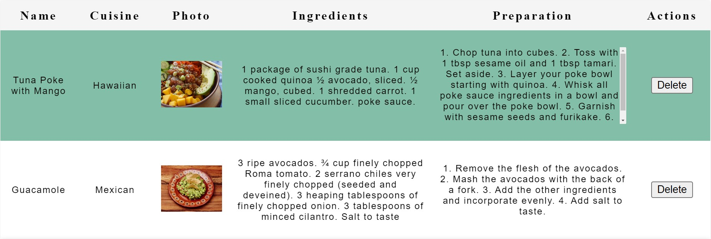

# Delicious Food Recipes CRUD App!


## A demonstration of advanced React development in the form of a recipe tracking app


A CRUD application allows a user to create, read, update or delete selected data. For this project, I built the interface of a food recipe CRUD app. The app will allow a user to add new recipes, display a list of recipes and delete a recipe from the list by clicking a delete button. This project is designed to demonstrate my ability to work with rendering and state management using React, including meeting objectives such as:

- Installing packages via NPM

- Running tests from the command line

- Writing React function components

- Using hooks like useState()

- Debugging React code through console output

## Create Recipe
To create a recipe entry, the app has a form with input fields for the name of the dish, the cuisine it belongs to, and a URL that points to a picture of the dish. This component utilizes ```<textarea>``` for the ingredients and preparation. 
  
  
## List Recipes
To read and display the list of recipes, this component uses a table structure. Each recipe displays the name, cuisine, photo, ingredients, preparation and a delete button. Clicking the delete button should remove the entire row/recipe from the list.  A demonstration of the layout is shown below:


## Styling
Some of the styling elements and properties used to acheive a smooth, fluid layout include:

- Using the ```nth-child``` to set the width of the columns.

- Using the ```nth-child(odd)``` to set the table's zebra striping color pattern for the rows in tbody.

- The preparation and ingredient columns display a scrollbar if there is too much text.

- Uses the ```object-fit``` property to scale-down the images and set the image width and height to 100%.

## Concepts and tools used to assist in the implementation of the project:

- **Single-responsibility principle:** A principle that states that each module, function, or component in a program should have responsibility for one single part of the program.
- **ES6 Importing and exporting**, including default/named exports and named imports.
- **JSX:** called JSX, it is a syntax extension to JavaScript. Using it with React helps describe what the UI should look like. JSX may remind you of a template language, but it comes with the full power of JavaScript.
- **Functional components:** JavaScript functions that returns JSX


